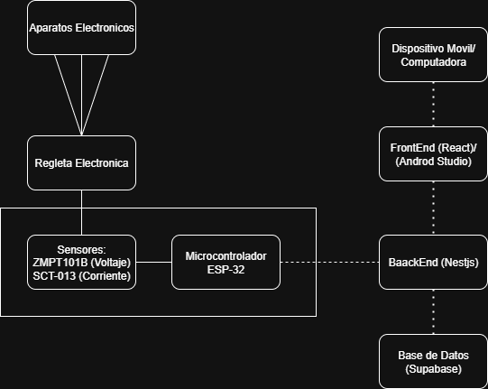
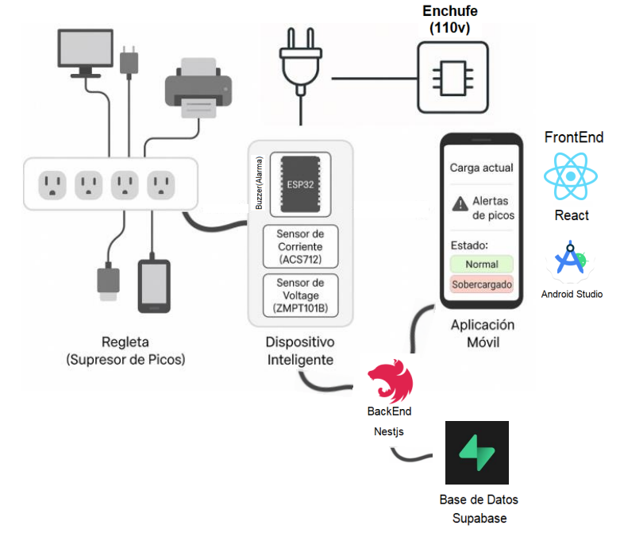

# Diagrama de Arquitectura del Sistema "SmartView Energy"

## 1. Capa de Dispositivos Físicos (IoT)
### Regleta Inteligente (Supresor de Picos)
→ Distribuye la energía a los dispositivos conectados.

### ESP32 (Microcontrolador)
→ Encargado de procesar datos de sensores y enviarlos al backend.

- **Sensor de Corriente (SCT-013)**  
  Mide la corriente consumida en tiempo real.

- **Sensor de Voltaje (ZMPT101B)**  
  Mide el voltaje de entrada.

- **Buzzer/Alarma**  
  Se activa cuando hay una sobrecarga.

## 2. Capa de Comunicación
### Wi-Fi
El ESP32 se conecta por Wi-Fi al servidor backend enviando datos eléctricos.

## 3. Capa Backend
### NestJS (API REST)
- Recibe datos desde el ESP32.
- Procesa, almacena y responde a las solicitudes del frontend.
- Expone endpoints para el monitoreo y autenticación.

## 4. Capa de Persistencia
### Supabase (Base de Datos PostgreSQL)
- Almacena los datos de sensores, usuarios, alertas y estados de carga.
- Provee funcionalidades tipo Firebase: autenticación, almacenamiento y API en tiempo real.

## 5. Capa Frontend
### Aplicación Web (React)
- Visualiza la información de la regleta: carga actual, estado (normal o sobrecargado).

### Aplicación Móvil (Android Studio + React + Capacitor)
- Ofrece las mismas funcionalidades que la web.
- **Notificaciones Push** cuando se detecta una sobrecarga.

---

## Flujo de Datos
1. Los dispositivos conectados a la regleta consumen energía.  
2. El ESP32 mide corriente y voltaje, y detecta sobrecargas.  
3. Envía datos al backend NestJS por HTTP (o MQTT si se desea escalar).  
4. NestJS almacena los datos en Supabase.  
5. El frontend (React/Android) consulta los datos desde el backend.  
6. Si se detecta sobrecarga, el buzzer suena y se envía una notificación push al móvil.
