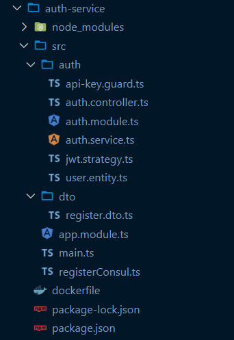
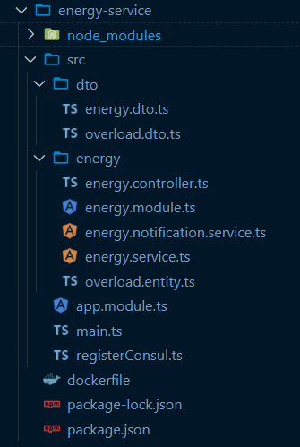

# Informe: Migración a Arquitectura de Microservicios

## Proyecto:  
**Dispositivo Guardián Inteligente para Regletas Electrónicas**  
Arquitectura distribuida basada en microservicios utilizando NestJS, React y Feign Client para descubrimiento de servicios.

---

## 1. Funcionalidades separadas y razones

### 1. Auth-Service (Servicio de Autenticación)
**Responsabilidad:** Registro de usuarios, login, validación de tokens JWT, eliminación de cuentas.

**Motivo de separación:**
- Encapsular la lógica de autenticación y autorización.
- Permitir escalabilidad independiente (es decir, si muchos usuarios inician sesión simultáneamente).
- Reutilizable por otros servicios o aplicaciones.

### 2. Energy-Service (Servicio de Monitoreo Energético)
**Responsabilidad:** Procesamiento y almacenamiento de datos eléctricos (voltaje, corriente, potencia), detección de sobrecargas y alertas.

**Motivo de separación:**
- Separa la lógica de negocio específica del dominio de energía.
- Permite aplicar reglas de negocio sin afectar autenticación.
- Escalabilidad en caso de gran flujo de datos desde sensores.

### 3. API Gateway
**Responsabilidad:** Punto de entrada único para las peticiones desde el frontend, reenvía las solicitudes a los microservicios correspondientes, aplicando control de acceso, logging y balanceo.

**Motivo de inclusión:**
- Ocultar la arquitectura interna del sistema.
- Centralizar seguridad y validación de tokens.
- Simplificar las URLs para el cliente frontend.

---

## 2. Estructura de los microservicios

Cada microservicio sigue la arquitectura típica de NestJS, con sus propios módulos, controladores y servicios.

### Estructura común de microservicios:

#### auth-service/



#### energy-service/



**Cada uno:**
- Se ejecuta de forma **independiente**.
- Expone su propia API REST.

---

## 3. Comunicación entre microservicios y demostración del funcionamiento

### Consumo REST entre servicios

Para la comunicación entre `energy-service` y `auth-service`, se utiliza **consumo REST**

```ts
// energy-service/src/utils/auth-client.ts
import axios from 'axios';

export async function validateToken(token: string) {
  const res = await axios.post('http://auth-service:4001/auth/validate', {}, {
    headers: { Authorization: token }
  });
  return res.data;
}
```

Este cliente puede usarse en un Guard o interceptor para proteger rutas.

### Flujo de demostración

1. **Frontend** realiza `POST /auth/login` al **API Gateway** (`localhost:4000`).
2. El **API Gateway** consulta para ubicar `auth-service`, y reenvía la solicitud.
3. `auth-service` responde con un token JWT.
4. El frontend guarda ese token y lo usa para acceder a `/energy/monitor`.
5. El **API Gateway** reenvía esta solicitud al `energy-service`.
6. `energy-service` valida el token haciendo una llamada REST al `auth-service`.
7. Si la validación es exitosa, devuelve los datos energéticos.

---

## Conclusiones

- La arquitectura basada en microservicios logró separar adecuadamente responsabilidades por dominio.
- La solución es **escalable**, **resiliente** y lista para crecer.
